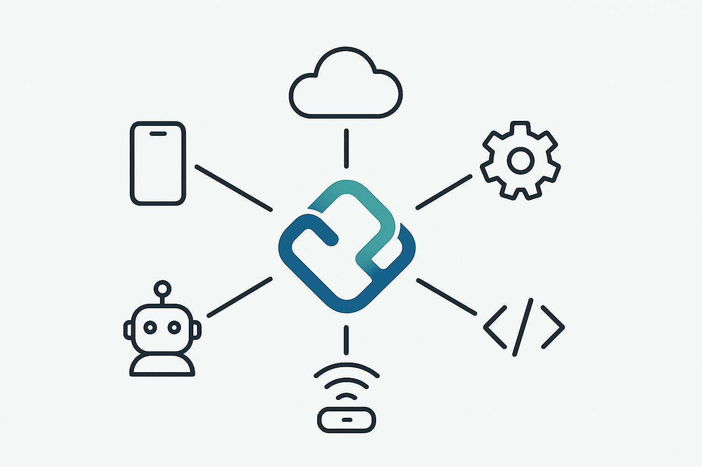

# ReGenNexus Core

ReGenNexus Core is an open-source implementation of the Universal Agent Protocol (UAP) developed by ReGen Designs LLC. It provides a standardized communication framework for digital entities to interact seamlessly.



## Core Features

- **Message Protocol**: Standardized message format for entity communication
- **Entity Registry**: Discovery and registration system for digital entities
- **Context Management**: Conversation state and history tracking
- **Enhanced Security**: End-to-end encryption with ECDH-384 and certificate-based authentication
- **Device Integration**: Support for Raspberry Pi, Arduino, Jetson, and IoT devices
- **ROS 2 Integration**: Bridge for Robot Operating System communication
- **Azure IoT Bridge**: Standalone bridge for Azure IoT Hub connectivity

## Interactive Demos

Try ReGenNexus interactively in Google Colab:

- [Basic Demo](https://colab.research.google.com/github/ReGenNow/ReGenNexus/blob/main/examples/binder/colab_basic_demo.ipynb) - Demonstrates core communication features between agents
- [Security Demo](https://colab.research.google.com/github/ReGenNow/ReGenNexus/blob/main/examples/binder/colab_security_demo.ipynb) - Showcases enhanced security features including ECDH-384, certificates, and policy-based access control

These notebooks allow you to experience ReGenNexus functionality without setting up anything locally.

## Getting Started

### Installation

### Standard Installation (Recommended for Users)

```bash
# Clone the repository
git clone https://github.com/ReGenNow/ReGenNexus.git

cd ReGenNexus
# Create a virtual environment 
python3 -m venv venv
source bot/bin/activate
pip install .

# Run the registry and client
regennexus-registry  # Starts the server
regennexus-client    # Runs the client
```
### Development Installation (For Contributors)

```bash
git clone https://github.com/ReGenNow/ReGenNexus.git
cd ReGenNexus

# Install dependencies
pip install -r requirements.txt

# Install in development mode
pip install -e .

# Run the registry and client
regennexus-registry  # Starts the server
regennexus-client    # Runs the client
```

### Quick Example

```python
import asyncio
from regennexus.protocol.client import UAP_Client
from regennexus.protocol.message import UAP_Message

async def main():
    # Create a client
    client = UAP_Client(entity_id="my_agent", registry_url="localhost:8000")
    
    # Connect to the registry
    await client.connect()
    
    # Send a message
    message = UAP_Message(
        sender="my_agent",
        recipient="target_device",
        intent="command",
        payload={"action": "turn_on", "parameters": {"device": "light"}}
    )
    await client.send_message(message)
    
    # Register a message handler
    async def handle_message(message):
        print(f"Received message: {message.payload}")
    
    client.register_message_handler(handle_message)
    
    # Keep the client running
    await client.run()

if __name__ == "__main__":
    asyncio.run(main())
```

## Documentation

- [Getting Started Guide](docs/getting_started.md)
- [Core Protocol Documentation](docs/core_protocol.md)
- [API Reference](docs/api_reference.md)
- [Security Guide](docs/security.md)
- [Device Integration](docs/device_integration.md)
- [ROS Integration](docs/ros_integration.md)
- [Azure Bridge](docs/azure_bridge.md)
- [Docker Deployment](docs/docker_deployment.md)

## Examples

The `examples/` directory contains several examples demonstrating different aspects of the protocol:

- **Simple Connection**: Basic protocol usage and tutorial
- **Security**: Authentication and encryption features
- **Device Integration**: Working with Raspberry Pi, Arduino, and Jetson devices
- **ROS Integration**: Connecting with Robot Operating System
- **Patterns**: Event-driven communication patterns

## Docker Support

ReGenNexus Core includes Docker support for easy deployment:

```bash
# Build and run with Docker Compose
docker-compose up
```

See the [Docker Deployment Guide](docs/docker_deployment.md) for more details.

## Contributing

We welcome contributions to ReGenNexus Core! Please see [CONTRIBUTING.md](CONTRIBUTING.md) for guidelines.

## Roadmap

See [ROADMAP.md](ROADMAP.md) for the development roadmap and future plans.

## License

ReGenNexus Core is released under the MIT License. See [LICENSE](LICENSE) for details.

## About ReGen Designs LLC

ReGen Designs LLC is focused on creating next-generation communication protocols for digital entities. The ReGenNexus project aims to establish a universal standard for agent communication.
